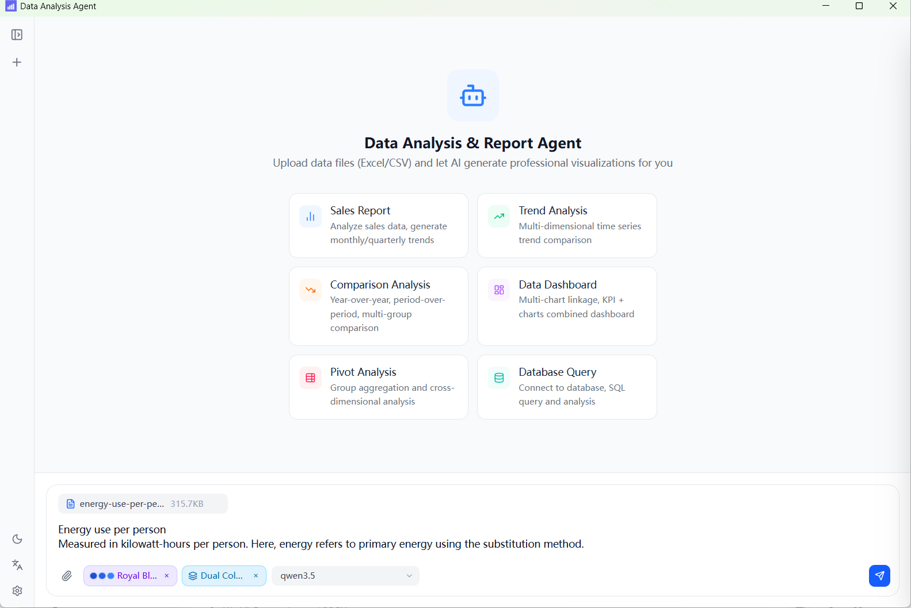
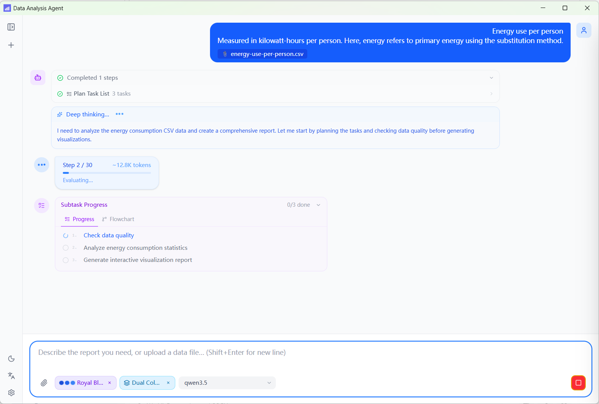
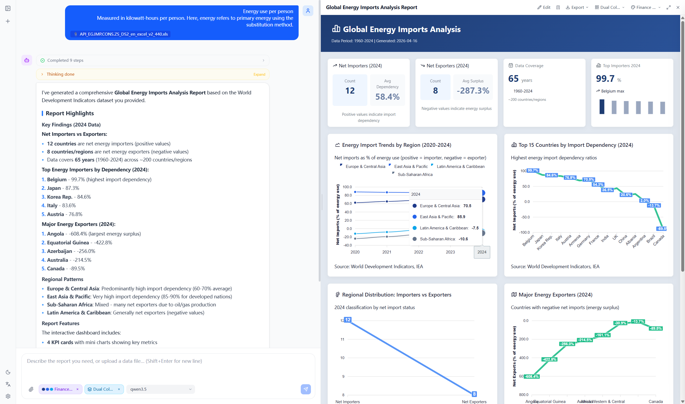
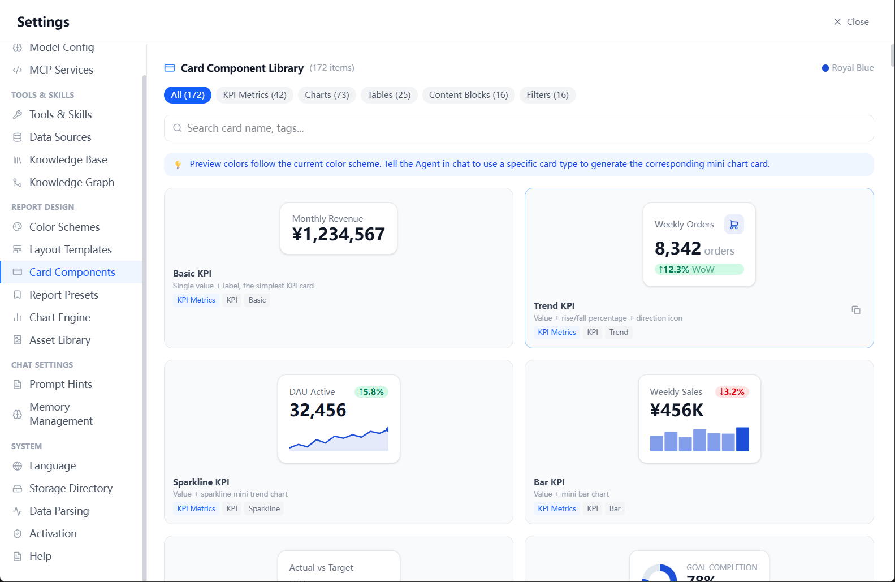
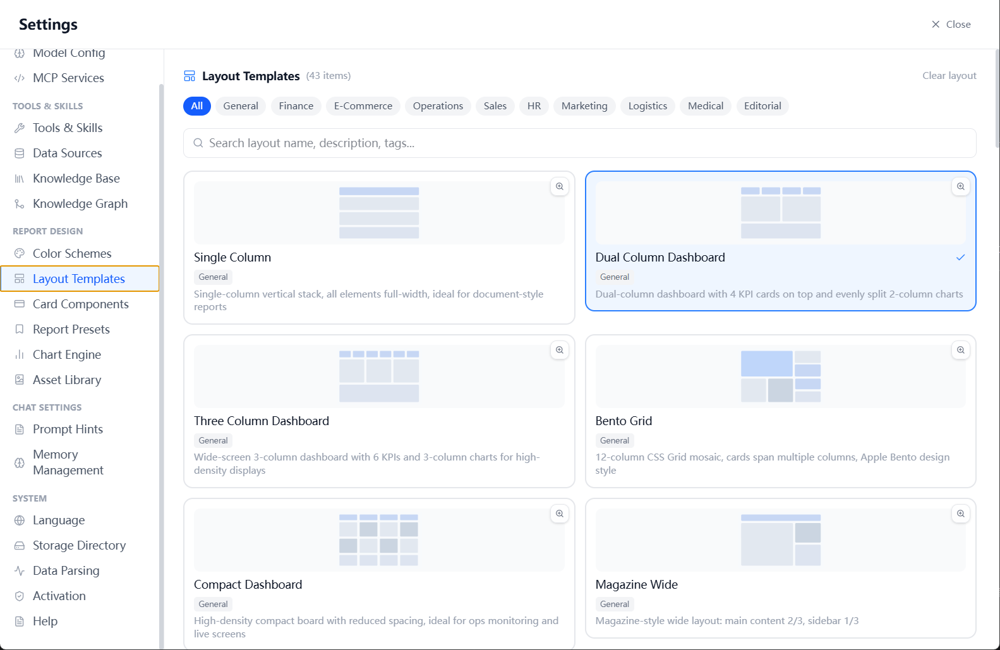
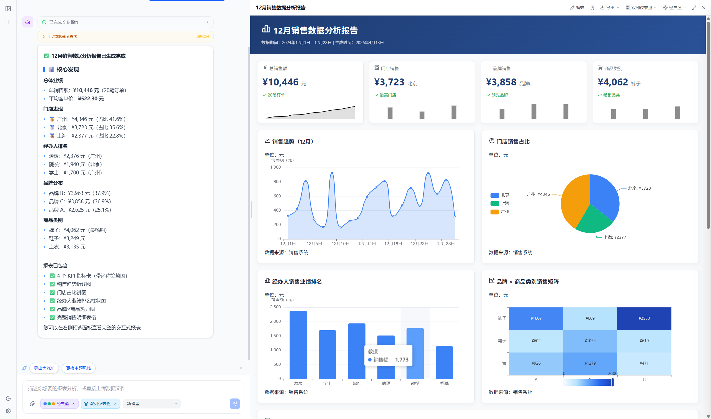

<div align="center">


# Datell

**A polished local-first AI analyst for interactive reporting.**

Upload files, connect databases, and describe the question in plain language. Datell turns that workflow into polished dashboards, export-ready reports, and presentations without forcing the model to reinvent the entire page every time.

上传文件、连接数据库、描述分析问题。Datell 会把这条工作流整理成交互式仪表盘、可导出的专业报表与演示文稿，而不是让模型每次从零开始“抽盲盒式”拼页面。

[](LICENSE)
[](https://github.com/aiis2/datell/releases/latest)
[](https://github.com/aiis2/datell/releases/latest)
[](https://www.electronjs.org/)
[](https://react.dev/)
[](https://www.typescriptlang.org/)
[](https://github.com/electron/electron)

[English](#english) · [中文](#中文)

</div>

---

## English

**Datell** is a polished local-first desktop analytics workspace built around a capable **ReAct agent**. It does more than answer questions: it can break work into steps, query databases, apply business context, and turn the result into interactive reports that feel ready to share.

Everything stays on-device by default, which makes Datell especially compelling when you want serious analysis, reusable outputs, and privacy without adding a cloud dependency.

### At a Glance

- Agentic analysis with visible reasoning, planning, execution, and verification
- Interactive HTML reports with filter-aware KPI linkage, multiple chart engines, and export-ready layouts
- Rich presentation surface with 170+ KPI cards, 40+ layouts, and built-in report presets
- Extensible stack with multi-LLM support, RAG, knowledge graph, MCP tools, and external databases

### Why Datell avoids prompt roulette

Many AI reporting products still rely on a fragile pattern: ask the model to improvise the page structure from scratch, hope the chart mix is reasonable, and hope filters, KPI summaries, and visual hierarchy happen to line up. That usually looks exciting in a demo and inconsistent in repeated use.

Datell takes a more systemized approach. The model works with a built-in report surface instead of an empty canvas:

- **20+ report presets** that bundle chart engine, layout direction, and styling defaults
- **43+ layout templates** spanning dashboards, documents, bento grids, wide screens, and poster formats
- **60+ palette presets** with runtime palette injection for ECharts, ApexCharts, and VTable rendering
- **172 KPI and chart card patterns** that give the agent stable building blocks instead of one-off HTML improvisation
- **Filter-aware interactivity runtime** that coordinates controls, chart updates, KPI refresh paths, and DuckDB-backed data rebinding

That means the agent can still be creative where it matters, but the output is guided by reusable structure, visual consistency, and interaction contracts. In practice, Datell behaves much more like a report system with an AI operator than a prompt slot machine.

---

### Download

| Platform | File | Notes |
|----------|------|-------|
| **Windows x64** | [`Datell-1.0.0-win-x64-portable.exe`](https://github.com/aiis2/datell/releases/download/v1.0/Datell-1.0.0-win-x64-portable.exe) | Portable, no install needed |
| macOS x64 | [`Datell-1.0.0-mac-x64.dmg`](https://github.com/aiis2/datell/releases/download/v1.0/Datell-1.0.0-mac-x64.dmg) | Intel Mac |
| macOS arm64 | [`Datell-1.0.0-mac-arm64.dmg`](https://github.com/aiis2/datell/releases/download/v1.0/Datell-1.0.0-mac-arm64.dmg) | Apple Silicon (M1/M2/M3) |
| Linux x64 | [`Datell-1.0.0.AppImage`](https://github.com/aiis2/datell/releases/download/v1.0/Datell-1.0.0.AppImage) | Portable AppImage for most distros |

> **[→ View all releases](https://github.com/aiis2/datell/releases/latest)**

> **macOS first launch**: If blocked by Gatekeeper, right-click the app → "Open".

---

### Highlights

#### From data to report, in one message

Upload Excel / CSV or connect directly to a database. Describe what you want to analyze in plain language. Datell handles data cleaning, analysis, and visualization — outputting interactive HTML reports, Excel files, PDFs, or slide decks automatically.



---

#### Real agent, not just Q&A

Built on **ReAct (Reasoning + Acting)** architecture, the agent exposes its full reasoning process: Think → Plan → Execute → Verify. Every step is visible. Multi-step task progress panels make complex analyses transparent.



---

#### Professional reports, out of the box

Generated reports are fully interactive HTML dashboards — not static screenshots. Dynamic ECharts / ApexCharts, KPI cards with sparklines, filter linkage, DuckDB real-time SQL re-querying. Live preview on the right.



---

#### 172 KPI card components

The built-in card library covers KPI metric cards (trend indicators, period-over-period), Sparkline line charts, mini bar charts, gauge dials, progress bars, comparison matrices, and more. The agent picks the right card type for your data automatically.



---

#### 43+ layout templates across industries

Single-column, dual-pane dashboard, three-column wide, Bento Grid, magazine-wide, poster (portrait & landscape) — categorized by industry (Finance / Sales / HR / Marketing / Medical / Logistics). Switch the entire report layout with one click.



---

#### Real report example — monthly sales analysis

A complete monthly sales report auto-generated from sales data: 4 KPI cards, trend line chart, store-share pie chart, sales ranking bar chart, and a brand × product heatmap — all produced in a single pass.



---

#### Real report example — global energy data

A 60-year dataset covering 200+ countries. Datell automatically explores the data, computes statistics, compares trends, and generates a multi-dimensional visualization report.


---

### Technical Architecture

- **Desktop shell**: Electron 41 packages a TypeScript main process with a React 19 + Vite renderer, keeping the app portable across Windows, macOS, and Linux.
- **Secure data plane**: database execution and credential handling stay in the main process, so the renderer works with sanitized results and orchestration APIs instead of raw secrets.
- **Report runtime**: `public/report-shell.html` hosts preview and export rendering, applies layout and palette state, and keeps chart runtimes aligned across preview, export, and capture flows.
- **Interactivity layer**: `interactivity-engine.js` and `filter-controls.js` coordinate filter changes, chart registration, KPI refresh paths, and DuckDB-backed rebinding for interactive reports.
- **Knowledge layer**: SQLite persists app state locally, ONNX-based embeddings support local RAG, Kuzu provides the knowledge graph, and MCP endpoints extend the tool surface.

---

### Features

#### AI Chat · ReAct Agent

- Datell runs on the **ReAct (Reasoning + Acting)** architecture — the agent plans, calls tools, and iterates autonomously until the task is complete
- Full conversation history in the sidebar with rename and search support
- Multi-agent collaboration: parallel sub-agents, serial pipelines, aggregation nodes, nested calls
- Real-time task progress panel for multi-step execution
- `ask_user` tool for mid-task clarification (AG2UI interaction)
- Thinking chain display, full support for reasoning models

#### Report Generation & Export

| Output Format | Description |
|---------------|-------------|
| **HTML Report** | Interactive ECharts / ApexCharts, filter linkage, DuckDB dynamic SQL rebinding |
| **VTable Big Data Table** | Virtual scroll, 100K+ rows, pivot tables, tree tables, frozen columns |
| **Excel File** | Structured data export as `.xlsx` |
| **PDF File** | One-click HTML → PDF export |
| **Slides / Presentation** | Multi-page HTML slideshow with keyboard navigation, exportable to PDF |
| **Document** | Rich-text HTML document for printing or PDF export |
| **Poster** | Full-page single-card poster (portrait & landscape / 16:9) |

- **Report Presets**: 20+ bundled "palette + layout + chart engine" style packs (Business, Finance, Tech, Marketing, HR, Print)
- **Layout Template Library**: 43+ visual grid layouts with custom editor
- **Color Palette Library**: 60+ presets with custom editor
- **KPI Cards + Mini Charts** (Sparkline, Gauge, Progress bar) embedded in reports

#### Multi-Database Connectivity

- Supports **MySQL / MariaDB / Apache Doris · PostgreSQL · Presto**
- Built-in **SSH tunnel** — no manual port forwarding needed
- Connection pool management, automatic schema exploration (tables / column comments)
- Natural language → SQL queries, results injected directly into reports

#### Knowledge Base (RAG)

- **Local vector store**: ONNX local embedding model, fully offline
- **Dify**: Connect to Dify API / external dataset retrieval
- **Ragflow**: Connect to Ragflow document understanding pipeline
- Custom chunking strategies (delimiter, max length, overlap)

#### Knowledge Graph

- Built-in **Kuzu** graph database, persistent nodes and edges
- Visual editor (add/delete nodes/relationships), agent can read/write the graph via tools

#### Model Compatibility

| Provider | Notes |
|----------|-------|
| OpenAI | GPT-4o / GPT-4.1, multimodal vision |
| Anthropic | Claude 3.x / Claude 4 series |
| Google | Gemini 2.x Flash / Pro |
| Ollama | Local models (Qwen, Llama, Mistral, etc.) |
| OpenAI-compatible | Any compatible endpoint (SiliconFlow, DeepSeek, vLLM, etc.) |
| OpenRouter | Unified multi-model routing |

Multiple model instances with free switching per chat; configurable `baseUrl`, `maxTokens`, `temperature`.

#### Tools & Extensions

- Connect to any **MCP (Model Context Protocol) HTTP/SSE** server — tools are auto-discovered and registered
- Custom skills: drop JSON skill files into `datellData/skills/` for hot-loaded tools; the app currently scans `*.json` directory skills and can also install compatible `skill.json` payloads from URLs or GitHub repositories
- Settings -> Skills now provides a unified panel for built-in tool manifests, registry-backed skills, legacy directory skills, and AI-created dynamic tools

#### Other

- Dark / Light theme
- Chinese / English UI (`zh-CN` / `en-US`)
- File parsing: Excel (`.xlsx`), CSV, PDF, images (multimodal upload)
- All data persisted locally via SQLite — nothing leaves your machine
- Agent long-term memory, retains user preferences across sessions
- `web_fetch` tool for fetching web content
- Portable build for Windows, no installation needed

---

### Getting Started

#### Prerequisites

- **Node.js** ≥ 20.x
- **npm** ≥ 10.x
- Windows / macOS / Linux

#### Install Dependencies

```bash
git clone https://github.com/aiis2/datell.git
cd datell
npm install
```

#### Development Mode

```bash
npm run dev
```

> This starts the Vite dev server (port 5173) and Electron main process concurrently. The system RAG index is built automatically on first run.

---

### Building

```bash
# Windows portable build (x64)
npm run build:win

# macOS (x64 + arm64 DMG)
npm run build:mac

# Linux AppImage
npm run build:linux
```

Build artifacts are output to the `release/` directory.

> **Note**: The `release/` directory is excluded from git via `.gitignore`.

---

### Configuration

#### Add AI Models

Go to **Settings → Models** to add model configurations:

- **Provider**: OpenAI / Anthropic / Google / Ollama / OpenAI-compatible / OpenRouter
- **API Key**: Enter the key for the corresponding service
- **Base URL**: Set a custom address for proxies or compatible endpoints
- **Model ID**: Model name (e.g. `gpt-4o`, `claude-3-5-sonnet-20241022`, `gemini-2.0-flash`)

#### Connect External Databases

Go to **Settings → Datasources** to add connections:

- Supports MySQL / Apache Doris, PostgreSQL, Presto
- Enable **SSH tunnel** and fill in bastion host details for automatic encrypted forwarding

#### Add Knowledge Bases

Go to **Settings → Knowledge Base**:

- **Local**: Upload documents — the system auto-chunks, embeds locally, and indexes for full-text search
- **Dify**: Enter API URL and Dataset ID
- **Ragflow**: Enter API URL and Dataset ID

#### Custom Skills

Create JSON skill files in `datellData/skills/` — the current loader scans `*.json` directory skills. Restart the app or use the refresh action in Settings -> Skills to reload them.

For file-backed custom skills with richer lifecycle management, use the registry section in Settings -> Skills:

- Registry skills are stored under `datellData/skills/registry/user/*.skill.json`
- You can create, edit, import, export, and delete registry skills from the UI
- Legacy directory skills and AI-created dynamic tools can be promoted into the registry without changing the legacy compatibility loaders
- Script-backed registry skills and dynamic skills can reuse enabled built-in tools via `await callTool(name, args)`, which allows a custom skill to trigger `generate_chart`, `generate_document`, `generate_slide`, and other built-in report actions
- A tracked example registry skill is available at `skill/examples/visual-report-smoke.skill.json`; it demonstrates composing HTML inside a custom skill and delegating the final preview render to `callTool("generate_chart", ...)`
- A publish-ready Agent Skills working tree now lives under `skill/publish/agentskills/`; it currently exposes a single installable skill at `skills/datell-visual-report-preview/` with an MCP-first workflow and a no-MCP fallback that still carries Datell card-library, layout, and palette guidance, while `mcp/` remains the Track B visual-report runtime skeleton

---

### License

This project is licensed under the [Apache License 2.0](LICENSE).

```
Copyright 2026 Datell Contributors

Licensed under the Apache License, Version 2.0 (the "License");
you may not use this file except in compliance with the License.
You may obtain a copy of the License at

    http://www.apache.org/licenses/LICENSE-2.0
```

---

## 中文

**Datell** 是一款打磨得相当完整的本地优先桌面数据分析工作台，核心是一套可执行、多步骤的 **ReAct 智能体**。它不只是回答问题，而是会主动拆解任务、查询数据库、结合业务上下文，并把结果整理成真正可交互、可分享的专业报表。

默认情况下，所有数据与对话都留在本机。这让 Datell 很适合既重视分析深度、结果复用，也重视隐私控制的团队和个人。

### 快速概览

- 可见的智能体分析流程：思考、规划、执行、验证完整展开
- 可交互 HTML 报表：筛选联动 KPI、图表与导出布局协同工作
- 很完整的展示层：170+ KPI 卡片、40+ 布局模板和多图表引擎
- 可扩展能力栈：多模型、RAG、知识图谱、MCP 工具与外部数据库

### 为什么 Datell 不会变成“报表抽盲盒”

很多 AI 报表产品仍然沿用一种很脆弱的方式：把整页结构交给模型临场发挥，期待它每次都能碰巧选对布局、图表组合、KPI 样式和筛选逻辑。演示时看起来很快，连续使用时往往就会暴露出不稳定和不一致。

Datell 走的是更系统化的路线。模型面对的不是一块完全空白的画布，而是一套内置的报表表达系统：

- **20+ 报告预设**：把图表引擎、布局方向和样式默认值打包成稳定组合
- **43+ 布局模板**：覆盖仪表盘、文档、Bento Grid、宽屏大屏和海报等不同场景
- **60+ 调色板预设**：运行时可同步注入到 ECharts、ApexCharts 和 VTable
- **172 个 KPI / 图表卡片模式**：让 Agent 基于稳定组件拼装，而不是每次即兴写一套 HTML
- **筛选联动运行时**：统一处理控件、图表更新、KPI 刷新路径和基于 DuckDB 的数据重绑

这意味着 Agent 仍然可以在分析与表达上保持灵活，但输出结果会被可复用的结构、视觉一致性和交互契约约束住。实际体验上，Datell 更像是一套由 AI 驱动的专业报表系统，而不是一次次碰运气的提示词老虎机。

---

### 下载

| 平台 | 文件 | 说明 |
|------|------|------|
| **Windows x64** | [`Datell-1.0.0-win-x64-portable.exe`](https://github.com/aiis2/datell/releases/download/v1.0/Datell-1.0.0-win-x64-portable.exe) | 免安装，双击直接运行 |
| macOS x64 | [`Datell-1.0.0-mac-x64.dmg`](https://github.com/aiis2/datell/releases/download/v1.0/Datell-1.0.0-mac-x64.dmg) | Intel Mac |
| macOS arm64 | [`Datell-1.0.0-mac-arm64.dmg`](https://github.com/aiis2/datell/releases/download/v1.0/Datell-1.0.0-mac-arm64.dmg) | Apple Silicon (M1/M2/M3) |
| Linux x64 | [`Datell-1.0.0.AppImage`](https://github.com/aiis2/datell/releases/download/v1.0/Datell-1.0.0.AppImage) | 适用于大多数发行版的便携 AppImage |

> **[→ 查看所有发行版](https://github.com/aiis2/datell/releases/latest)**

> **macOS 首次打开说明**：如提示「无法打开」，请右键点击应用 → 选择「打开」即可。

---

### 核心亮点

#### 一句话，从数据到报表

上传 Excel / CSV，或直接连接数据库，用自然语言描述你要分析的内容，Agent 会自动完成数据清洗、分析、可视化，输出带交互图表的 HTML 报表、Excel 文件、PDF 或演示文稿。


---

#### 真正的 Agent，不是简单的问答

基于 **ReAct（Reasoning + Acting）** 架构，Agent 会展示完整的推理过程：思考 → 规划 → 执行 → 验证，每一步都透明可见。支持多步骤任务进度面板，复杂分析任务不再是黑盒。


---

#### 专业级报表，开箱即用

生成的报表不是静态截图，而是完全可交互的 HTML 大屏：ECharts / ApexCharts 动态图表、KPI 卡片带迷你趋势图、筛选器联动、DuckDB 实时 SQL 重查询。右侧实时预览，所见即所得。


---

#### 精美的 KPI 卡片 + 迷你图表

内置 **172 个**卡片组件：KPI 指标卡（含趋势方向、环比变化）、Sparkline 折线图、迷你柱状图、仪表盘、进度条、对比矩阵……Agent 会根据数据自动选配最合适的卡片类型。


---

#### 43 套布局模板，覆盖各类业务场景

单列文档、双栏仪表盘、三栏宽屏、Bento Grid、杂志宽版……按行业分类（Finance / Sales / HR / Marketing / Medical / Logistics），一键切换报表布局，无需手动排版。


---

#### 真实报表示例 — 销售数据月报

以下是 Agent 基于销售数据自动生成的完整月报，包含 4 个 KPI 卡片、趋势折线图、门店饼图、业绩排名柱状图和品牌×商品热力图，全部由 AI 一次性自动完成。


---

#### 真实报表示例 — 全球能源数据分析

跨越 60 年、覆盖 200+ 个国家的能源数据集，Agent 自动完成数据探索、统计汇总、趋势对比与分布分析，生成多维可视化报表。


---

### 技术架构

- **桌面外壳**：基于 Electron 41，采用 TypeScript 主进程和 React 19 + Vite 渲染层，统一打包 Windows、macOS、Linux。
- **安全数据面**：数据库连接与查询执行留在主进程，渲染层拿到的是经过整理的结果和编排 API，而不是原始凭据。
- **报表运行时**：`public/report-shell.html` 负责承载预览与导出渲染，统一应用布局、调色板和运行时注入逻辑，保证预览、导出、截图链路尽量一致。
- **交互层**：`interactivity-engine.js` 与 `filter-controls.js` 负责筛选变化、图表注册、KPI 刷新路径以及基于 DuckDB 的联动重查询。
- **知识层**：本地 SQLite 持久化应用状态，ONNX Embedding 支撑本地 RAG，Kuzu 提供知识图谱，MCP 负责外部工具扩展。

---

### 功能特性

#### AI 对话 · ReAct 智能体

- 基于 **ReAct（Reasoning + Acting）** 架构，Agent 自主规划、调用工具、循环推理直至任务完成
- 多轮对话历史，侧边栏支持重命名与搜索
- 多智能体协作：并行子 Agent、串行流水线、汇聚节点，支持嵌套调用
- 任务进度面板实时展示多步骤执行状态
- `ask_user` 工具支持执行过程中向用户提问（AG2UI 交互）
- 思维链（Thinking）展示，支持推理模型

#### 报表生成与导出

| 输出格式 | 描述 |
|----------|------|
| **HTML 报表** | 含 ECharts / ApexCharts 交互图表，支持滤镜联动、DuckDB 动态 SQL 重绑 |
| **VTable 大数据表格** | 虚拟滚动，支持 10 万+ 行，透视表、树形表、冻结列 |
| **Excel 文件** | 结构化数据导出为 `.xlsx` |
| **PDF 文件** | HTML 报表一键导出 PDF（页面截图合并）|
| **幻灯片/演示文稿** | HTML 多页幻灯片，支持键盘翻页，可导出 PDF |
| **专业文档** | HTML 富文本文档，适合打印或导出 PDF |

- **报告预设**：内置 20+ 套"配色 + 布局 + 图表引擎"一键风格包（商业、财务、科技、营销、HR、打印等分类）
- **布局模板库**：40+ 套可视化网格布局，支持自定义编辑
- **配色方案库**：60+ 套调色板预设，支持自定义创建与编辑
- **KPI 卡片 + 迷你图表**（Sparkline、仪表盘、进度条等）内嵌于报表

#### 多数据库连接

- 支持 **MySQL / MariaDB / Apache Doris · PostgreSQL · Presto**
- 内置 SSH 隧道，无需手动端口转发
- 连接池管理、Schema 自动探索（表结构 / 字段注释）
- 自然语言 → SQL 查询，结果实时注入报表

#### 知识库（RAG）

- **本地向量库**：基于 ONNX 本地 Embedding 模型，离线可用
- **Dify 知识库**：接入 Dify API / 外部数据集检索
- **Ragflow 知识库**：接入 Ragflow 文档理解流水线
- 自定义分块策略（分隔符、最大长度、重叠率）

#### 知识图谱

- 内置 **Kuzu** 图数据库，持久化节点与边
- 可视化编辑器（增删节点/关系），Agent 可通过工具写入/查询图谱

#### 模型兼容

| 提供商 | 说明 |
|--------|------|
| OpenAI | GPT-4o / GPT-4.1 等，含视觉多模态 |
| Anthropic | Claude 3.x / Claude 4 系列 |
| Google | Gemini 2.x Flash / Pro |
| Ollama | 本地模型（Qwen、Llama、Mistral 等） |
| OpenAI 兼容 | 任意兼容接口（硅基流动、DeepSeek、vLLM 等） |
| OpenRouter | 统一路由多模型 |

支持配置多个模型实例、聊天时自由切换；支持自定义 `baseUrl`、`maxTokens`、`temperature`。

#### 工具与扩展

- 接入任意 **MCP（Model Context Protocol）HTTP/SSE** 服务器，自动发现并注册工具
- 自定义技能：在 `datellData/skills/` 放置 JSON 技能文件即可加载目录技能；当前加载器会扫描 `*.json` 文件，也支持从 URL 或 GitHub 仓库安装兼容的 `skill.json` 内容
- “设置 -> 技能” 已统一展示内置工具 manifest、registry 技能、legacy 目录技能与 AI 动态技能

#### 其他

- 深色 / 浅色主题
- 中英文界面（`zh-CN` / `en-US`）
- 文件解析：Excel（`.xlsx`）、CSV、PDF、图片（多模态上传）
- 全量本地 SQLite 持久化，数据不离机
- Agent 长期记忆，跨会话保留用户偏好
- `web_fetch` 工具支持抓取网页内容
- Windows 绿色便携版，无需安装

---

### 快速开始

#### 前置条件

- **Node.js** ≥ 20.x
- **npm** ≥ 10.x
- Windows / macOS / Linux

#### 安装依赖

```bash
git clone https://github.com/aiis2/datell.git
cd datell
npm install
```

#### 开发模式

```bash
npm run dev
```

> 启动后会并行运行 Vite 开发服务器（端口 5173）与 Electron 主进程。首次运行会自动构建系统 RAG 索引。

---

### 构建打包

```bash
# Windows 便携版（x64）
npm run build:win

# macOS（x64 + arm64 DMG）
npm run build:mac

# Linux AppImage
npm run build:linux
```

构建产物输出至 `release/` 目录。

> **注意**：`release/` 目录已在 `.gitignore` 中排除，不会提交到仓库。

---

### 配置说明

#### 添加 AI 模型

在 **设置 → 模型** 中新增模型配置：

- **提供商**：OpenAI / Anthropic / Google / Ollama / OpenAI 兼容 / OpenRouter
- **API Key**：填入对应服务的密钥
- **Base URL**：如使用代理或兼容接口，填入自定义地址
- **Model ID**：模型名称（如 `gpt-4o`、`claude-3-5-sonnet-20241022`、`gemini-2.0-flash`）

#### 连接外部数据库

在 **设置 → 数据源** 中添加数据库连接：

- 支持 MySQL / Apache Doris、PostgreSQL、Presto
- 可开启 **SSH 隧道**，填入跳板机信息后自动建立加密转发

#### 添加知识库

在 **设置 → 知识库** 中：

- **本地知识库**：上传文档，系统自动分块、本地 Embedding、全文检索
- **Dify**：填入 API URL 和 Dataset ID
- **Ragflow**：填入 API URL 和 Dataset ID

#### 自定义技能

在 `datellData/skills/` 目录创建 JSON 技能文件；当前加载器会扫描 `*.json` 目录技能。重启应用或在“设置 -> 技能”中点击刷新后即可重新加载。

如果需要更完整的技能生命周期管理，可直接使用“设置 -> 技能”中的 registry 区域：

- registry 技能保存于 `datellData/skills/registry/user/*.skill.json`
- 支持在 UI 中新建、编辑、导入、导出、删除 registry 技能
- 也支持把 legacy 目录技能和 AI 动态技能提升到 registry，而不破坏现有兼容加载链路
- 脚本型 registry 技能和动态技能现在可以通过 `await callTool(name, args)` 复用已启用的内置工具，因此可直接在技能内部触发 `generate_chart`、`generate_document`、`generate_slide` 等报表动作并把结果送入预览面板
- 仓库已提供可追踪的真实示例技能 [skill/examples/visual-report-smoke.skill.json](skill/examples/visual-report-smoke.skill.json)，演示如何在技能内部组织 HTML，再通过 `callTool("generate_chart", ...)` 把可视化报表送入预览链路

---

### 许可证

本项目以 [Apache License 2.0](LICENSE) 开源。

```
Copyright 2026 Datell Contributors

Licensed under the Apache License, Version 2.0 (the "License");
you may not use this file except in compliance with the License.
You may obtain a copy of the License at

    http://www.apache.org/licenses/LICENSE-2.0
```
